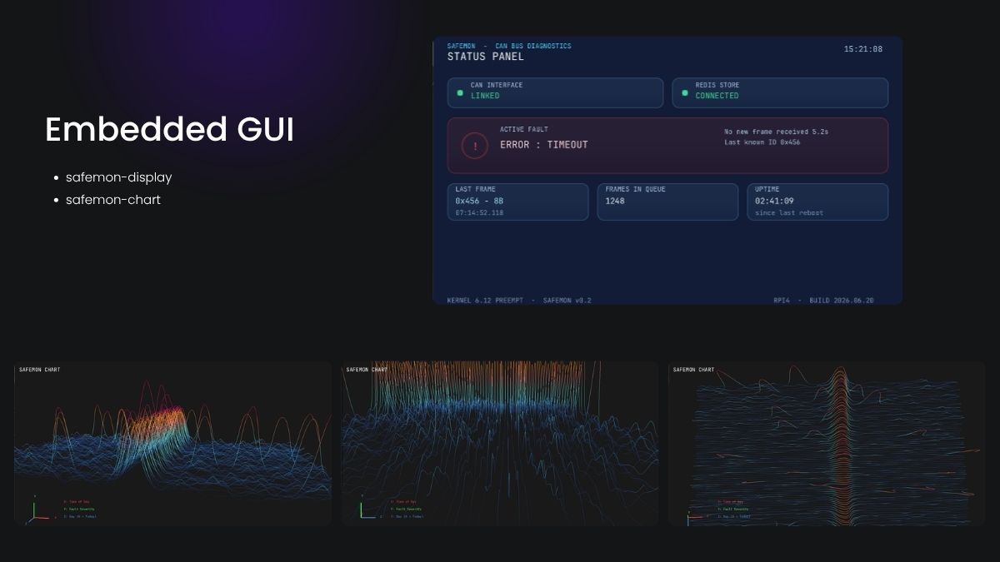

# Safemon

A custom embedded Linux functional safety monitor built with Yocto Scarthgap 5.0.
Monitors CAN bus frames, detects faults, streams fault events over gRPC, and renders a live status dashboard using OpenGL ES. Designed around ISO 26262 principles.

## Table of Contents

- [Safemon](#safemon)
  - [Table of Contents](#table-of-contents)
  - [Supported Targets](#supported-targets)
  - [System Architecture](#system-architecture)
  - [Display Pipeline](#display-pipeline)
  - [Embedded GUI](#embedded-gui)
  - [safemon-gui](#safemon-gui)
  - [Repository Structure](#repository-structure)
  - [Quick Start](#quick-start)
  - [Hardware](#hardware)
  - [Dependencies](#dependencies)
  - [Documentation](#documentation)

## Supported Targets

| Target | Machine | Display | Status |
|--------|---------|---------|--------|
| Raspberry Pi 4 | `raspberrypi4-64` | OpenGL ES via GBM/DRM — DSI LCD or HDMI | Working |
| Jetson Orin Nano | `jetson-orin-nano-devkit` | OpenGL ES via Wayland/Weston — HDMI | Working |
| QEMU | `qemuarm64` | OpenGL ES via virtio-gpu — GTK window | Working |

## System Architecture

## Display Pipeline

See [docs/spec-graphics.md](docs/spec-graphics.md) for the full display pipeline, connector selection logic, and HDMI/DSI configuration details.

## Embedded GUI

Two OpenGL ES applications render live diagnostics directly on the framebuffer — no browser, no app framework:

- **`safemon-display`** — a glassmorphism status panel showing live CAN bus and Redis health, active fault state, and frame telemetry, polling Redis once per second.
- **`safemon-chart`** — a 3D fault waterfall visualizing severity across time-of-day and day-of-week, color-mapped from blue (healthy) to red (critical).

Both run identically across all three supported targets.

## safemon-gui

A desktop management tool for safemon devices, built with Python and Qt (PyQt6 + QML). Supports key management, file signing, live fault monitoring, and device status checks.

See [safemon/tools/safemon-gui/README.md](safemon/tools/safemon-gui/README.md) for setup and usage.

## Repository Structure

    safemon-yocto/
    ├── docs/                        -- documentation and architecture diagrams
    ├── meta-safemon/                -- custom Yocto layer
    │   ├── conf/                    -- distro configs (RPi4, Jetson, QEMU)
    │   ├── recipes-bsp/             -- board support patches
    │   ├── recipes-connectivity/    -- Wi-Fi, vcan network config
    │   ├── recipes-kernel/          -- kernel config fragments
    │   └── recipes-safemon/         -- safemon-app and safemon-display recipes
    ├── safemon/                     -- C++ application source
    │   ├── src/                     -- application source files
    │   ├── inc/                     -- headers
    │   ├── lib/                     -- ECDSA library
    │   ├── proto/                   -- gRPC protobuf definitions
    │   └── tools/                   -- Python tools (signing, fault client)
    ├── scripts/                     -- build and test helper scripts
    ├── kas-rpi4.yml                 -- kas build config for Raspberry Pi 4
    ├── kas-jetson.yml               -- kas build config for Jetson Orin Nano
    └── kas-qemu.yml                 -- kas build config for QEMU (qemuarm64)

## Quick Start

Build and flash an image for your target:

**Raspberry Pi 4**

    kas build kas-rpi4.yml

**Jetson Orin Nano**

    KAS_BUILD_DIR=build-jetson kas build kas-jetson.yml

**QEMU**

    KAS_BUILD_DIR=build-qemu kas build kas-qemu.yml

See [docs/dev-guide.md](docs/dev-guide.md) for full build, flash, and run instructions.

## Hardware

| Target | Display Output | Notes |
|--------|---------------|-------|
| Raspberry Pi 4 Model B | DSI LCD (Waveshare 4.3" 800x480) or HDMI | Boots from USB stick |
| Jetson Orin Nano Dev Kit 8GB | HDMI via Weston compositor | Custom Yocto + meta-tegra |
| QEMU (qemuarm64) | GTK window via virtio-gpu | Runs on WSL2 (Windows 11) |

## Dependencies

The following repositories must be cloned separately by kas:

- [poky](https://git.yoctoproject.org/poky) — scarthgap
- [meta-raspberrypi](https://github.com/agherzan/meta-raspberrypi) — scarthgap
- [meta-openembedded](https://github.com/openembedded/meta-openembedded) — scarthgap
- [meta-tegra](https://github.com/OE4T/meta-tegra) — Jetson target only

Build tool: [kas](https://kas.readthedocs.io/) 5.3

## Documentation

| File | Description |
|------|-------------|
| [dev-guide](docs/dev-guide.md) | Build, flash, and run instructions for all targets |
| [signing](docs/signing.md) | ECDSA key generation and config signing workflow |
| [spec-graphics](docs/spec-graphics.md) | full display pipeline |
| [embedded-gui](docs/embedded-gui.md) | Display applications, rendering architecture, troubleshooting |
