# Project Architecture

## Overview

safemon is a multi-process embedded Linux safety monitor. Each component runs as an independent process and communicates through Redis as a central message bus.

## Components

**safemon-app** reads raw CAN frames from `vcan0`, pushes them to Redis (`safemon:can:frames`), and runs a `FaultDetector` thread that monitors for faults and publishes results to `safemon:faults:current`. A gRPC server inside the same process streams fault events to remote clients on port 50051. On startup, ECDSA signature verification runs against the config file before any other initialization.

**safemon-display** reads from Redis every second and renders a live status dashboard on the DSI LCD using OpenGL ES 3.1 on the V3D GPU via DRM/KMS — no compositor, no display server.

**Redis 7.2** is the only shared state between processes. Two keys are used: `safemon:can:frames` (list of received CAN frames) and `safemon:faults:current` (current fault status string).

## Startup order

Both `safemon-app` and `safemon-display` run as systemd services. `safemon-app` starts first (depends on Redis), `safemon-display` starts after. The system is fully operational within ~30 seconds of boot with no manual intervention.

## Configuration

All runtime parameters are read from `/etc/safemon/safemon.conf` at startup — DRM device node, Redis host/port, known CAN IDs, and fault timeout. The config file is ECDSA-signed; an invalid or missing signature aborts startup.