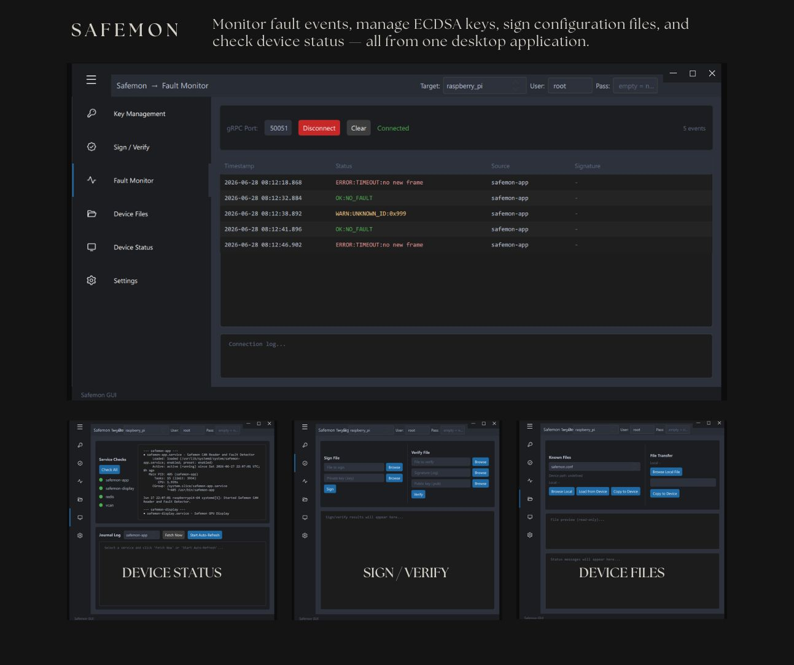

# safemon-gui

A desktop GUI application for managing and monitoring safemon devices (Raspberry Pi 4, Jetson Orin Nano, QEMU). Built with Python, PyQt6, and QML.



## Features

- **Key Management** — generate secp256k1 ECDSA key pairs and deploy public keys to devices
- **Sign / Verify** — sign configuration files with a private key and verify signatures
- **Fault Monitor** — live gRPC fault event stream from `safemon-app` with color-coded status table
- **Device Files** — transfer files to/from devices via SSH/SFTP, with automatic Unix line ending conversion
- **Device Status** — check systemd service status, Redis connectivity, and virtual CAN interface
- **Journal Viewer** — fetch and auto-refresh `journalctl` logs for `safemon-app` and `safemon-display`
- **Settings** — edit platform connection configs (host, port, user) and app preferences directly from the UI

## Requirements

- Python 3.10+
- Windows, Linux, or macOS

## Installation

```bash
cd safemon/tools/safemon-gui
pip install -r requirements.txt
```

For development and running tests:

```bash
pip install -r requirements-dev.txt
```

## Running

```bash
cd safemon/tools/safemon-gui
python main.py
```

## Supported Platforms

| Platform        | SSH Port | gRPC Port |
|-----------------|----------|-----------|
| Raspberry Pi 4  | 22       | 50051     |
| Jetson Orin Nano| 22       | 50051     |
| QEMU (in WSL2)  | 2222     | 50051     |

Platform connection details (host, port, user) are stored in `config/` and can be edited from the Settings page.

## Notes on QEMU

QEMU runs inside WSL2. Make sure port forwarding is configured in the QEMU launch script:

```bash
-netdev user,id=net0,hostfwd=tcp::2222-:22,hostfwd=tcp::50051-:50051
```

Use the WSL2 IP address (e.g. `172.19.7.64`) as the host in platform config.

## Tech Stack

- [PyQt6](https://www.riverbankcomputing.com/software/pyqt/) — Python bindings for Qt6
- [QML](https://doc.qt.io/qt-6/qmlapplications.html) — declarative UI language for the interface
- [Paramiko](https://www.paramiko.org/) — SSH/SFTP file transfer
- [grpcio](https://grpc.io/) — gRPC client for fault event streaming
- [pytest](https://pytest.org/) + [pytest-qt](https://pytest-qt.readthedocs.io/) — test suite

## Running Tests

```bash
cd safemon/tools/safemon-gui
pytest tests/ -v
```

## Project Structure

```
safemon-gui/
├── main.py                  # Entry point
├── requirements.txt         # Runtime dependencies
├── requirements-dev.txt     # Dev/test dependencies
├── config/                  # Platform and app configs (gitignored, auto-created)
├── core/
│   ├── config_manager.py    # Config file load/save
│   ├── ssh_manager.py       # SSH/SFTP connection manager
│   └── workers.py           # QThread worker base class
├── ui/
│   ├── backend/             # Python backends exposed to QML
│   └── qml/                 # QML UI files
│       ├── main.qml
│       ├── controls/        # Reusable QML components
│       └── pages/           # One QML file per page
└── tests/
    ├── unit/
    └── integration/
```