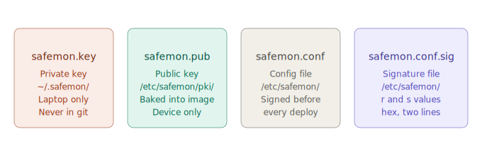

# Config Signing Guide

safemon uses ECDSA (secp256k1) to verify config and calibration files before
loading them. Files are signed on the developer's laptop with a private key.
The device holds only the public key and uses it to verify on startup.

If verification fails, `safemon-app` aborts with an error — it will not run
with an unsigned or tampered config.

---

## How it works



---

## One-time setup



### 1. Generate a key pair

Run once on your laptop. Keep the private key safe — never commit it to git,
never copy it to the device.

```bash
python3 safemon/tools/safemon-sign/safemon_sign.py keygen \
    --out ~/.safemon/safemon.key
```

This produces:
- `~/.safemon/safemon.key` — private key (stay on laptop)
- `~/.safemon/safemon.pub` — public key (deploy to device)

### 2. Create the pki directory on the device

```bash
ssh root@PI_IP "mkdir -p /etc/safemon/pki"
```

### 3. Deploy the public key to the device

Do this once per device, or whenever you rotate keys.

```bash
scp ~/.safemon/safemon.pub root@PI_IP:/etc/safemon/pki/safemon.pub
```

---

## Signing a config or calibration file

Every time you change `safemon.conf` (or any other file that requires
verification), sign it and copy both the file and its signature to the device.

### 1. Sign the file

```bash
python3 safemon/tools/safemon-sign/safemon_sign.py sign \
    --key ~/.safemon/safemon.key \
    --file meta-safemon/recipes-safemon/safemon/files/safemon.conf
```

This produces `safemon.conf.sig` next to the original file.

### 2. Copy file and signature to the device

```bash
scp meta-safemon/recipes-safemon/safemon/files/safemon.conf \
    root@PI_IP:/etc/safemon/safemon.conf

scp meta-safemon/recipes-safemon/safemon/files/safemon.conf.sig \
    root@PI_IP:/etc/safemon/safemon.conf.sig
```

### 3. Verify locally before copying (optional but recommended)

```bash
python3 safemon/tools/safemon-sign/safemon_sign.py verify \
    --pub ~/.safemon/safemon.pub \
    --file meta-safemon/recipes-safemon/safemon/files/safemon.conf \
    --sig  meta-safemon/recipes-safemon/safemon/files/safemon.conf.sig
```

---

## File locations



| File | Location | Notes |
|------|----------|-------|
| `safemon.key` | `~/.safemon/safemon.key` | Private key — laptop only, never in git |
| `safemon.pub` | `~/.safemon/safemon.pub` | Public key — deploy to device |
| `safemon.pub` | `/etc/safemon/pki/safemon.pub` | Public key on device |
| `safemon.conf` | `/etc/safemon/safemon.conf` | Config file on device |
| `safemon.conf.sig` | `/etc/safemon/safemon.conf.sig` | Signature on device |

---

## Key file format

Keys are stored as JSON with four little-endian 64-bit hex limbs.
`limb[0]` holds the least significant 64 bits, `limb[3]` the most significant.

```json
{
    "private_key":  ["...", "...", "...", "..."],
    "public_key_x": ["...", "...", "...", "..."],
    "public_key_y": ["...", "...", "...", "..."]
}
```

The public key file (`safemon.pub`) contains only `public_key_x` and
`public_key_y` — no private key.

## Signature file format

Signatures are stored as two hex strings on separate lines — `r` then `s`,
each 64 hex characters (256 bits).

```
a3f1c8...  <- r
7b2e91...  <- s
```

---

## Troubleshooting

**`safemon-app` aborts with `[ecdsa] verify_file: cannot open public key`**
The public key is missing on the device. Run step 3 of the one-time setup.

**`safemon-app` aborts with `[startup] Config verification failed`**
Either the config was modified after signing, or the `.sig` file is missing.
Re-sign the config and copy both files to the device.

**`[ecdsa] verify_file: cannot open signature`**
The `.sig` file was not copied to the device. Copy `safemon.conf.sig` as shown
in step 2 of the signing section.

**Verify passes on laptop but fails on device**
The public key on the device does not match the private key used for signing.
Re-deploy `safemon.pub` to `/etc/safemon/pki/safemon.pub`.

---

## Baking signed config into the Yocto image

When building a new image, the signed config and public key must be present
in the recipe files directory before running `kas build`. On first boot,
`safemon-app` verifies the config immediately — if any file is missing the
service will fail to start.

### Pre-build checklist

Run these steps before every `kas build`:

#### 1. Sign the config

```bash
python3 safemon/tools/safemon-sign/safemon_sign.py sign \
    --key ~/.safemon/safemon.key \
    --file meta-safemon/recipes-safemon/safemon/files/safemon.conf
```

This produces `safemon.conf.sig` next to the config file.

#### 2. Copy the public key into the recipe files directory

```bash
cp ~/.safemon/safemon.pub \
    meta-safemon/recipes-safemon/safemon/files/safemon.pub
```

#### 3. Build the image

```bash
kas build kas-config.yml
```

The image will contain:
- `/etc/safemon/safemon.conf`
- `/etc/safemon/safemon.conf.sig`
- `/etc/safemon/pki/safemon.pub`

### After flashing

No manual key or config deployment needed — everything is already in the
image. `safemon-app` will verify and start cleanly on first boot.

---

## To-do

- [ ] Verify after next flash that all three files are present on the device
      and `safemon-app` starts cleanly without manual intervention