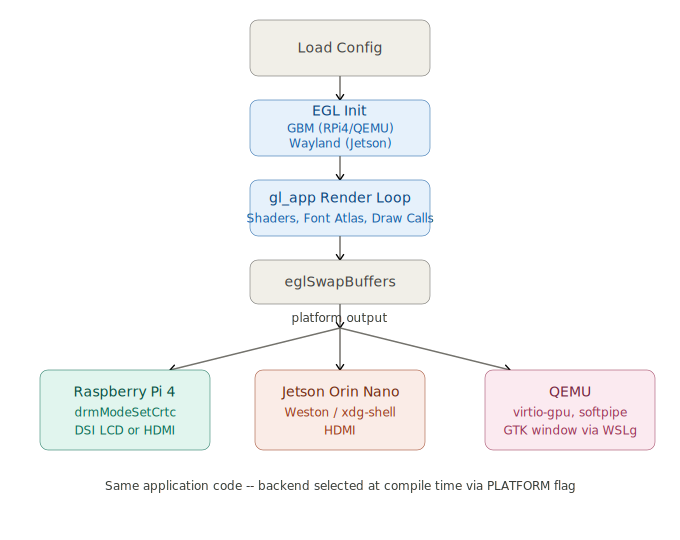

# Graphics and Display Specification

## Table of Contents

- [Graphics and Display Specification](#graphics-and-display-specification)
  - [Table of Contents](#table-of-contents)
  - [Overview](#overview)
  - [Display Pipeline](#display-pipeline)
  - [Connector Selection](#connector-selection)
  - [Raspberry Pi 4 -- HDMI and DSI](#raspberry-pi-4----hdmi-and-dsi)
    - [DSI LCD](#dsi-lcd)
    - [Switching to HDMI](#switching-to-hdmi)
    - [Resolution](#resolution)
  - [Jetson Orin Nano -- HDMI via Wayland](#jetson-orin-nano----hdmi-via-wayland)
  - [Jetson Resolution Detection](#jetson-resolution-detection)
  - [QEMU -- virtio-gpu](#qemu----virtio-gpu)
  - [Configuration Reference](#configuration-reference)

## Overview

`safemon-display` renders a live status dashboard using OpenGL ES 3.1. The
rendering pipeline differs by platform but the application code is shared
through a platform abstraction layer selected at compile time via the
`PLATFORM` CMake flag.

| Platform | EGL Backend | Output |
|----------|-------------|--------|
| Raspberry Pi 4 | Mesa GBM (`EGL_PLATFORM_GBM_MESA`) | DSI LCD or HDMI via DRM/KMS |
| Jetson Orin Nano | NVIDIA EGL (`EGL_PLATFORM_WAYLAND_KHR`) | HDMI via Weston/xdg-shell |
| QEMU (qemuarm64) | Mesa GBM, softpipe renderer | GTK window via virtio-gpu |

## Display Pipeline

## Connector Selection

On Raspberry Pi 4 and QEMU, `drm_open()` in `drm_helper.cpp` selects the
display connector with the following priority:

1. Open the DRM device specified by `drm_device` in `safemon.conf`
   (default: `/dev/dri/card1`)
2. Iterate all connectors on that device
3. If a connected DSI connector is found, use it immediately
4. Otherwise, fall back to the first connected connector found (typically HDMI)

Only one connector is active at a time -- the application does not support
simultaneous DSI and HDMI output.

## Raspberry Pi 4 -- HDMI and DSI

### DSI LCD

The project uses a Waveshare 4.3" 800x480 DSI LCD, enabled via a `config.txt`
overlay appended at image deploy time:

    meta-safemon/recipes-bsp/bootfiles/files/dsi.txt:
        dtoverlay=vc4-kms-dsi-waveshare-panel,4_3_inch
        display_auto_detect=1

This is appended to `config.txt` by
`meta-safemon/recipes-bsp/bootfiles/rpi-config_git.bbappend`.

With `display_auto_detect=1`, the VC4 KMS driver exposes both the DSI panel
and HDMI as connectors on `/dev/dri/card1`. `drm_open()` will prefer DSI if
the ribbon cable is connected.

### Switching to HDMI

To use HDMI instead of the DSI LCD:

- Disconnect the DSI ribbon cable, or
- The application will automatically fall back to HDMI if no DSI connector
  is detected as connected

No config or rebuild is required -- the connector selection happens at
runtime on every `safemon-display` startup.

### Resolution

DSI: 800x480 (fixed, panel native resolution)
HDMI: determined by the connected monitor's preferred mode (`modes[0]`)

## Jetson Orin Nano -- HDMI via Wayland

On Jetson, display output goes through the Weston compositor via
`xdg-shell`. Unlike RPi4, `safemon-display` does not access DRM/KMS directly
-- Weston owns the display.

The window resolution defaults to a fallback of 1920x1080 in
`safemon_display.cpp`, but the actual resolution is negotiated with the
Weston compositor at startup -- see
[Jetson Resolution Detection](#jetson-resolution-detection) below.

DSI is not currently supported on Jetson -- only HDMI via the Weston
compositor.

## Jetson Resolution Detection

`safemon-display` requests a fallback size of 1920x1080 when initializing
the Wayland surface, but the actual size is determined by the compositor's
`xdg_toplevel::configure` event after `xdg_toplevel_set_fullscreen()` is
called. The application reads back the negotiated size via `egl.width` /
`egl.height` and uses that for all rendering and viewport setup.

## QEMU -- virtio-gpu

QEMU uses the same GBM/DRM code path as Raspberry Pi 4. The guest kernel
exposes `/dev/dri/card0` via `virtio-gpu`, rendered with the Mesa softpipe
software renderer. Output is displayed in a GTK window on the host via
WSLg.

## Configuration Reference

| Config Key | Default | Description |
|------------|---------|-------------|
| `drm_device` | `/dev/dri/card1` | DRM device to open (RPi4, QEMU only) |

CMake platform flag (set in `safemon-app.bb`):

| Platform | `-DPLATFORM=` | Effect |
|----------|---------------|--------|
| Raspberry Pi 4 | `rpi4` | Uses `egl_helper_gbm.cpp`, links `mesa` |
| Jetson Orin Nano | `jetson` | Uses `egl_helper_wayland.cpp`, links `wayland*`, defines `PLATFORM_JETSON` |